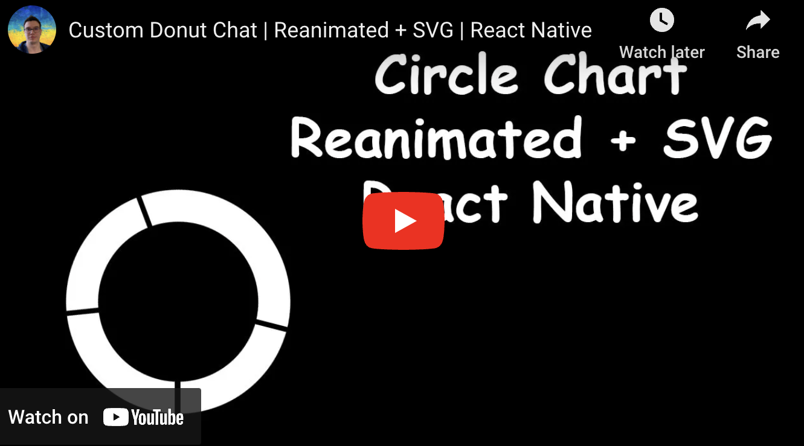
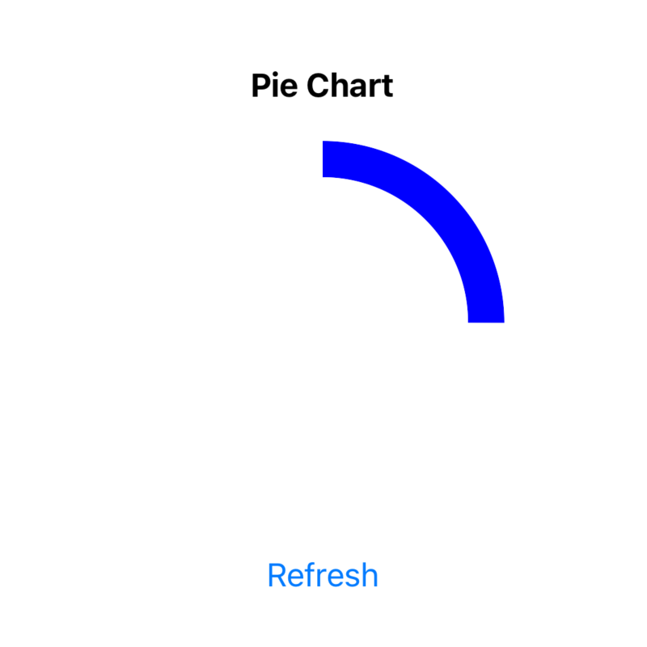
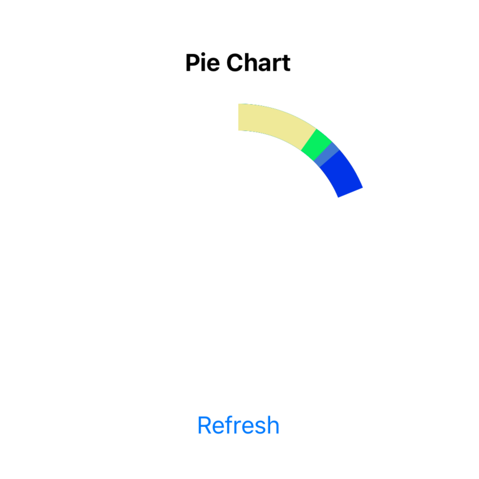
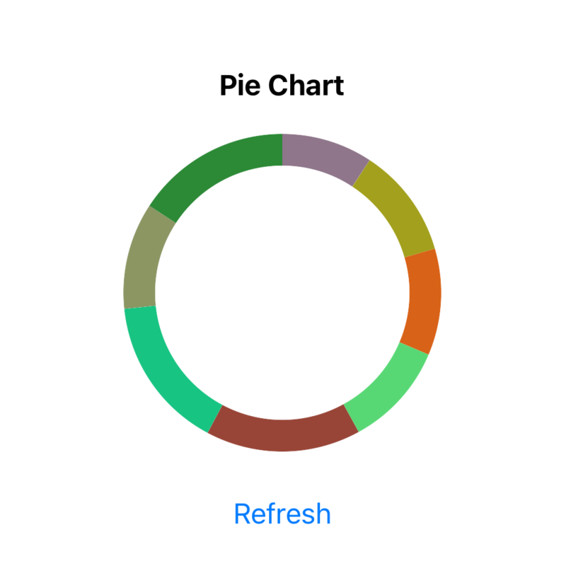
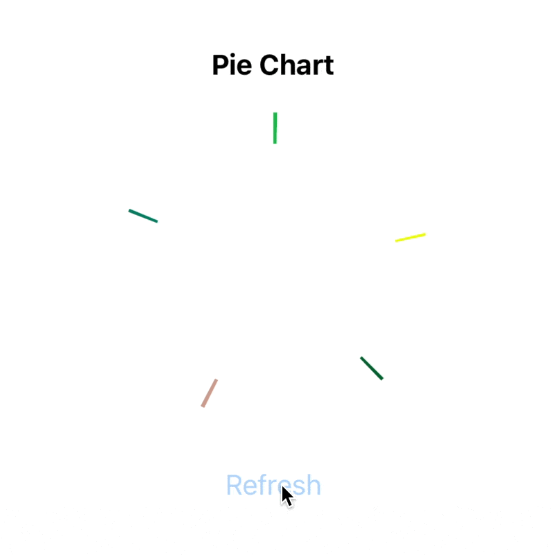

# React Native Animated Pie Chart (with SVG and reanimated)

<div align="center">
  <a align="center" href="https://github.com/dimaportenko?tab=followers">
    
  </a>
  <br/>
  <a align="center" href="https://twitter.com/dimaportenko">
    
  </a>
  <br/>
  <a align="center" href="https://www.youtube.com/channel/UCReKeeIMZywvQoaZPZKzQbQ">
    
  </a>
  <br/>
  <a align="center" href="https://www.youtube.com/channel/UCReKeeIMZywvQoaZPZKzQbQ">
    
  </a>
</div>
<br/>

Hey folks! As the title said we will build a circular chart with `react-native-svg` and `react-native-reanimated`. Our final result will look like


<!--  -->


<br>
<br>
<br>

[](https://youtu.be/owWQE9r9--w "SVG Reaniamted Chart Youtube Tutorial")

<br>

On refresh action, we're generating random data for our chart and showing it in an animated manner.

Let's start with the [template](https://github.com/dimaportenko/react-native-animated-chart-tutorial/tree/template) which has code generating random chart data. 

```typescript
export type PieChartData = {
  color: string;
  percent: number;
}[]
```

Since we have data we can start working on it's visualisation. Let's draw circle with `react-native-svg` first. 

```typescript
import Svg, {Circle} from 'react-native-svg';

const strokeWidth = 20;
const size = 200;
const center = size / 2;
const radius = (size - strokeWidth) / 2;

<Svg viewBox={`0 0 ${size} ${size}`}>
  <Circle
    cx={center}
    cy={center}
    r={radius}
    strokeWidth={strokeWidth}
    stroke={'blue'}
  />
</Svg>
```


So we added the root `Svg` component with `viewBox` of 200 x 200 size. And `Circle` inside with center, radius, stroke width, and color. 

For the pie chart, we will need just a segment of a circle. We can archive it with `strokeDashoffset` and `strokeDasharray` params.  

```typescript
const circumference = 2 * Math.PI * radius;

<Circle
  // ...
  strokeDashoffset={circumference * (1 - 0.25)} // 25% circle segment
  strokeDasharray={circumference}
/>
```


First of all, we calculate the `circumference`. And if we want a circle segment length of 25% then the rest 75% suppose to be `strokeDashoffset` like `circumference * (1 - 0.25)`.

Now we can loop over our data and draw all the chart segments.

```typescript
<Svg viewBox={`0 0 ${size} ${size}`}>
  {data.map((item, index) => (
    <Circle
      key={`${item.color}-${index}`}
      cx={center}
      cy={center}
      r={radius}
      strokeWidth={strokeWidth}
      stroke={item.color}
      strokeDashoffset={circumference * (1 - item.percent)}
      strokeDasharray={circumference}
    />
  ))}
</Svg>
```


We drew segments but they place on top of each other. To fix this we can rotate each segment on a sum of the angles of previous segments. 

```typescript
const [startAngles, setStartAngles] = React.useState<number[]>([]);

const refresh = () => {
  const generatedData = generatePieChartData();

  let angle = 0;
  const angles: number[] = [];
  generatedData.forEach(item => {
    angles.push(angle);
    angle += item.percent * 360;
  });

  setData(generatedData);
  setStartAngles(angles);
};


<Circle
  // ...
  originX={center}
  originY={center}
  rotation={startAngles[index]}
/>
```


To get an angle for a segment we need to multiply 360 (degrees in a circle) by the chart item percent. To rotate each segment around the center we also need to specify `originX` and `originY`. 

Ok, now we have a circle chart. Before starting animating it let's do small refactoring and move segment drawing in the separated component. 

```typescript
export const PieChartSegment: FC<{
  center: number;
  radius: number;
  strokeWidth: number;
  color: string;
  circumference: number;
  angle: number;
  percent: number;
}> = ({center, radius, strokeWidth, circumference, color, angle, percent}) => {
  return (
    <Circle
      cx={center}
      cy={center}
      r={radius}
      strokeWidth={strokeWidth}
      stroke={color}
      strokeDashoffset={circumference * (1 - percent)}
      strokeDasharray={circumference}
      originX={center}
      originY={center}
      rotation={angle}
    />
  );
};

```

Finally, let's use the reanimated library. Create `AnimatedCircle` component and use instead `Circle`.

```typescript
import Animated from 'react-native-reanimated';

const AnimatedCircle = Animated.createAnimatedComponent(Circle);

```

Then we add animated value `progress`. Pass `progress` to the `PieChartSegment` and animate it with `withTiming` in the `refresh` function.

```typescript
import Animated, {useSharedValue, withTiming} from 'react-native-reanimated';


export const PieChart = ({size = 200, strokeWidth = 20}: PieChartProps) => {
  const progress = useSharedValue(0);
  // ...

  const refresh = () => {
    // ...

    progress.value = 0;
    progress.value = withTiming(1, {
      duration: 1000,
    });
  };

  return (
    // ...
      <PieChartSegment
        // ...
        progress={progress}
      />
    // ...
  )

```

And in the `PieChartSegment` component, let's animate the segment length from 0 to its actual length. 

```typescript 
const animatedProps = useAnimatedProps(() => {
  const strokeDashoffset = interpolate(
    progress.value,
    [0, 1],
    [circumference, circumference * (1 - percent)],
  );

  return {
    strokeDashoffset,
  };
});

return (
  <AnimatedCircle
    // ...
    animatedProps={animatedProps}
  />
);
```



Basically, we created `animatedProps` with `strokeDashoffset` interpolated value. 

And the last step I want to do here is to animate the start position of each segment. Unfortunately, we can't simply interpolate `rotation` property (tbh I don't know why it just isn't working as I expect it). But we can't use the usual React Native transform styles. 

```typescript
const animatedProps = useAnimatedProps(() => {
  // ...
  const rotateAngle = interpolate(progress.value, [0, 1], [0, angle]);

  return {
    strokeDashoffset,
    transform: [
      {translateX: center},
      {translateY: center},
      {rotate: `${rotateAngle}deg`},
      {translateX: -center},
      {translateY: -center},
    ],
  };
});

return (
  <AnimatedCircle
    // ..
    // rotation={angle}
    // @ts-ignore
    animatedProps={animatedProps}
  />
);
```


Tricky part here is that you have to translate segment to the center, make rotation and then translate it back. 

That's it. Final code is available on [github](https://github.com/dimaportenko/react-native-animated-chart-tutorial). If you like it, please support me with likes and shares. Feel free to ask me anything in the comments. 

