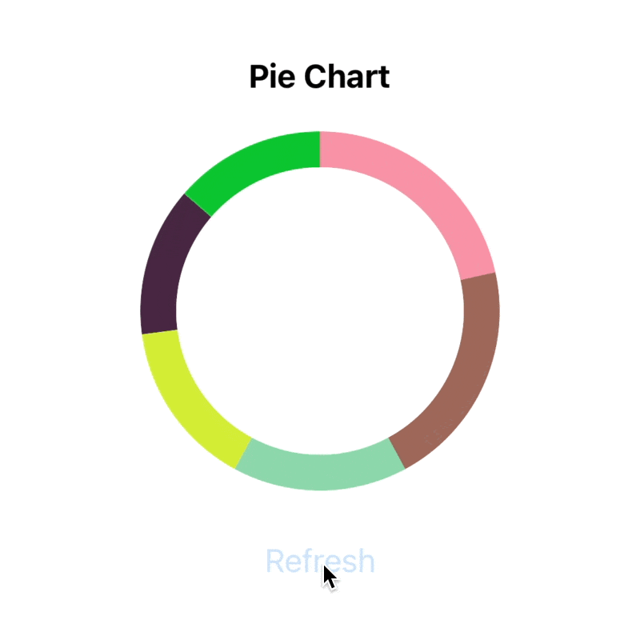
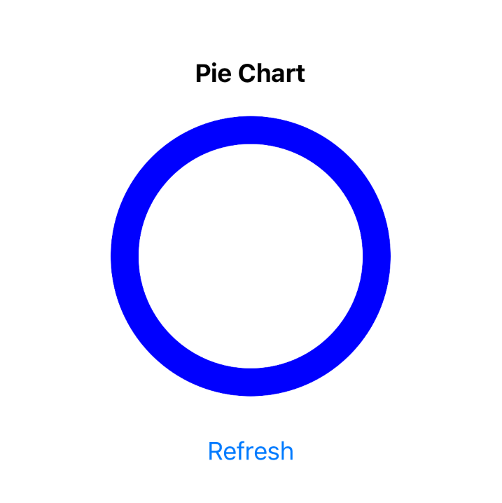

# React Native Animated Pie Chart (with SVG and reanimated)

Hey folks! As title said we will build circular chart with `react-native-svg` and `react-native-reanimated`. Our final result will look like


<!--  -->

On refresh action we're generating random data for our chart and show it in animated maner.

Let's start with [template](https://github.com/dimaportenko/react-native-animated-chart-tutorial/tree/template) which has code generating random chart data. 

```typescript
export type PieChartData = {
  color: string;
  percent: number;
}[]
```

Since we have data we can start working on it's visualisation. Let's draw circle with `react-native-svg` first. 

```typescript
import Svg, {Circle} from 'react-native-svg';

<Svg viewBox={`0 0 ${size} ${size}`}>
  <Circle
    cx={center}
    cy={center}
    r={radius}
    strokeWidth={strokeWidth}
    stroke={'blue'}
  />
</Svg>
```


