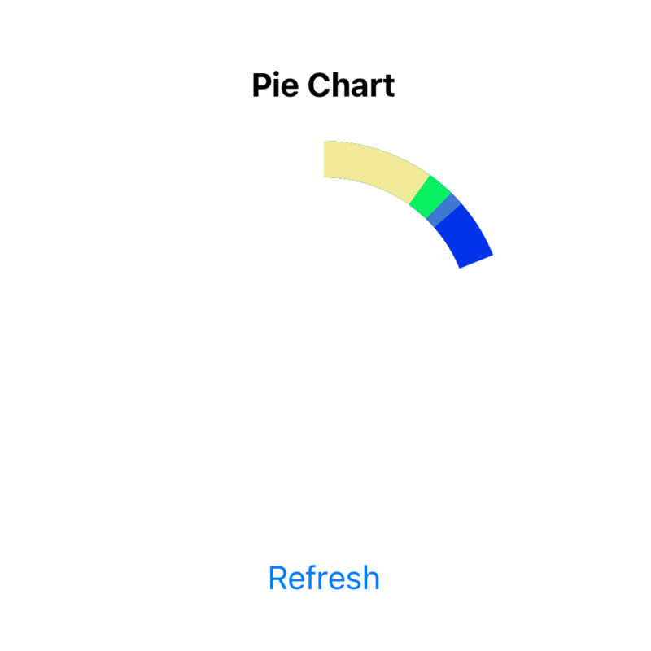
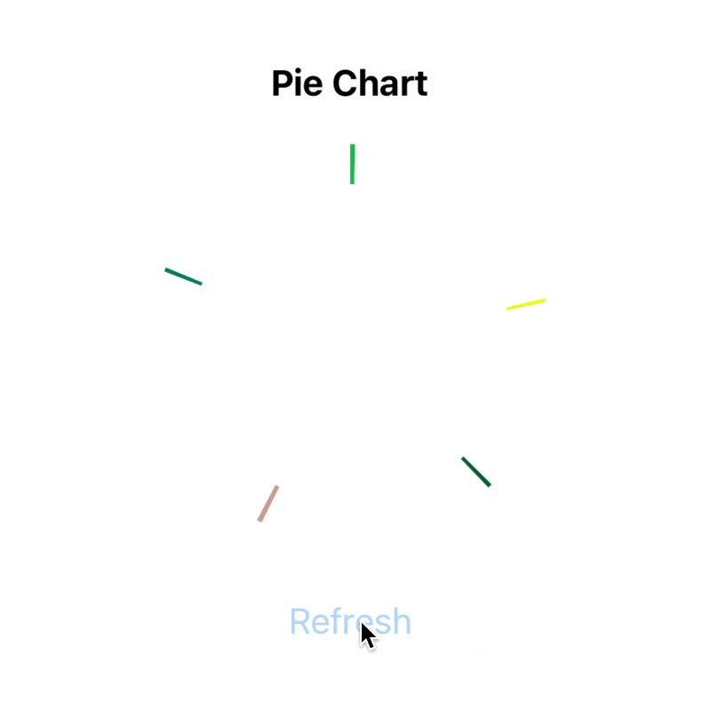

# React Native Animated Pie Chart (with SVG and reanimated)

Hey folks! As title said we will build circular chart with `react-native-svg` and `react-native-reanimated`. Our final result will look like


<!--  -->

On refresh action we're generating random data for our chart and show it in animated maner.

Let's start with [template](https://github.com/dimaportenko/react-native-animated-chart-tutorial/tree/template) which has code generating random chart data. 

```typescript
export type PieChartData = {
  color: string;
  percent: number;
}[]
```

Since we have data we can start working on it's visualisation. Let's draw circle with `react-native-svg` first. 

```typescript
import Svg, {Circle} from 'react-native-svg';

const strokeWidth = 20;
const size = 200;
const center = size / 2;
const radius = (size - strokeWidth) / 2;

<Svg viewBox={`0 0 ${size} ${size}`}>
  <Circle
    cx={center}
    cy={center}
    r={radius}
    strokeWidth={strokeWidth}
    stroke={'blue'}
  />
</Svg>
```


So we added root `Svg` component with `viewBox` of 200 x 200 size. And `Circle` inside with center, radious, stroke width and color. 

For pie chart we will need just a segment of circle. We can archive it with `strokeDashoffset` and `strokeDasharray` params.  

```typescript
const circumference = 2 * Math.PI * radius;

<Circle
  // ...
  strokeDashoffset={circumference * (1 - 0.25)} // 25% circle segment
  strokeDasharray={circumference}
/>
```


First of all we calculate `circumference`. And if we want circle segment length of 25% then rest 75% suppose to be `strokeDashoffset` like `circumference * (1 - 0.25)`.

Now we can loop over our data and draw all the chart segments.

```typescript
<Svg viewBox={`0 0 ${size} ${size}`}>
  {data.map((item, index) => (
    <Circle
      key={`${item.color}-${index}`}
      cx={center}
      cy={center}
      r={radius}
      strokeWidth={strokeWidth}
      stroke={item.color}
      strokeDashoffset={circumference * (1 - item.percent)}
      strokeDasharray={circumference}
    />
  ))}
</Svg>
```


We drew segments but they place on top of each other. To fix this we can rotate each segment on sum of angles of previous segments. 

```typescript
const [startAngles, setStartAngles] = React.useState<number[]>([]);

const refresh = () => {
  const generatedData = generatePieChartData();

  let angle = 0;
  const angles: number[] = [];
  generatedData.forEach(item => {
    angles.push(angle);
    angle += item.percent * 360;
  });

  setData(generatedData);
  setStartAngles(angles);
};


<Circle
  // ...
  originX={center}
  originY={center}
  rotation={startAngles[index]}
/>
```


To get angle for segment we need multiply 360 (degrees in circle) by chart item percent. To rotate each segment around the center we also need specify `originX` and `originY`. 

Ok, now we have circle chart. Before start animating it let's do small refactoring and move segment drawing in the separated component. 

```typescript
export const PieChartSegment: FC<{
  center: number;
  radius: number;
  strokeWidth: number;
  color: string;
  circumference: number;
  angle: number;
  percent: number;
}> = ({center, radius, strokeWidth, circumference, color, angle, percent}) => {
  return (
    <Circle
      cx={center}
      cy={center}
      r={radius}
      strokeWidth={strokeWidth}
      stroke={color}
      strokeDashoffset={circumference * (1 - percent)}
      strokeDasharray={circumference}
      originX={center}
      originY={center}
      rotation={angle}
    />
  );
};

```

Finally let's use reanimated library. Create `AnimatedCircle` component and use instead `Circle`.

```typescript
import Animated from 'react-native-reanimated';

const AnimatedCircle = Animated.createAnimatedComponent(Circle);

```

Then we add animated value `progress`. Pass `progress` to the `PieChartSegment` and animate it with `withTiming` in `refresh` function.

```typescript
import Animated, {useSharedValue, withTiming} from 'react-native-reanimated';


export const PieChart = ({size = 200, strokeWidth = 20}: PieChartProps) => {
  const progress = useSharedValue(0);
  // ...

  const refresh = () => {
    // ...

    progress.value = 0;
    progress.value = withTiming(1, {
      duration: 1000,
    });
  };

  return (
    // ...
      <PieChartSegment
        // ...
        progress={progress}
      />
    // ...
  )

```

And in the `PieChartSegment` component let's animated segment length from 0 to it's actual length. 

```typescript 
const animatedProps = useAnimatedProps(() => {
  const strokeDashoffset = interpolate(
    progress.value,
    [0, 1],
    [circumference, circumference * (1 - percent)],
  );

  return {
    strokeDashoffset,
  };
});

return (
  <AnimatedCircle
    // ...
    animatedProps={animatedProps}
  />
);
```



Basically, we created `animatedProps` with `strokeDashoffset` interpolated value. 

And the last step I want to do here is to animate start position of the each segment. Unfortunatly we can't simply interpolate `rotation` property (tbh I don't know why, it just isn't working as I expect it). But we can't use usual React Native transform styles. 

```typescript
const animatedProps = useAnimatedProps(() => {
  // ...
  const rotateAngle = interpolate(progress.value, [0, 1], [0, angle]);

  return {
    strokeDashoffset,
    transform: [
      {translateX: center},
      {translateY: center},
      {rotate: `${rotateAngle}deg`},
      {translateX: -center},
      {translateY: -center},
    ],
  };
});

return (
  <AnimatedCircle
    // ..
    // rotation={angle}
    // @ts-ignore
    animatedProps={animatedProps}
  />
);
```


Tricky part here is that you have to translate segment to the center, make rotation and then translate it back. 

That's it. If you like it, please support me with likes and shares. Feel free to ask me anything in the comments. 
